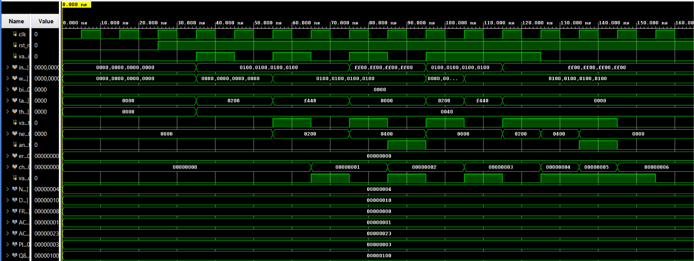
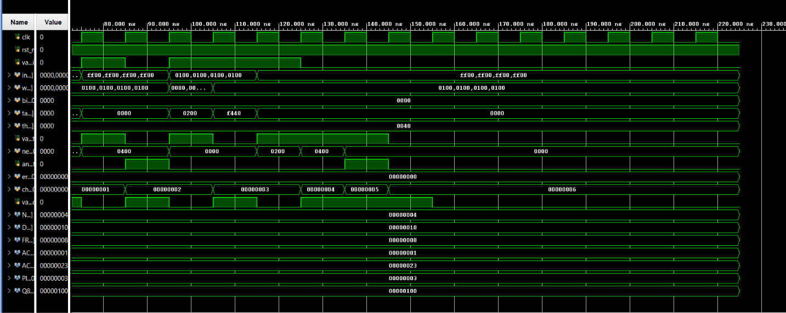

# TinyML Anomaly Detection Accelerator — SystemVerilog Implementation
> Developed during a summer research internship at the Instituto de Telecomunicações (IT).

## Overview

A synchronous, parametric single-neuron TinyML accelerator for industrial vibration anomaly
detection (autoencoder-style reconstruction), implemented in **SystemVerilog**, with **5
selectable activation functions**:

- **Linear / Bypass** — saturation only, no activation.
- **ReLU** — `f(x) = max(0, x)`.
- **LeakyReLU** — `x` if `x ≥ 0`, else `x >>> 3` (α = 0.125).
- **Hard-Swish** — `f(x) = x · clamp(x+3, 0, 6) / 6`, implemented via reciprocal multiplication
  (no hardware divider).
- **Sigmoid** — 256-entry ROM lookup table.

Arithmetic uses **Q8.8 fixed-point** (16-bit, 8 integer + 8 fractional bits, two's complement,
scale 256 — e.g. `1.0 decimal = 256 = 0x0100`).

The datapath consists of three pipelined stages:

```
inputs [N x 16b] ──┐
weights [N x 16b] ─┼──► mac_tree ──► accum_out (Q?.16) ──► activation_unit ──► neuron_out [Q8.8]
bias [16b] ────────┘    (2 cycles)                          (1 cycle)              │
                                                                                    ▼
target_expected ──────────────────────────────────────────────────► anomaly detector ──► anomaly_alert
threshold ─────────────────────────────────────────────────────────►  (|neuron_out - target| > threshold)
```

## Accumulator Width Derivation (ACC_WIDTH)

`mac_tree` computes `Z = Σ(Wᵢ·Xᵢ) + Bias` over `N` Q8.8 inputs. The rule of fixed-point
multiplication: fractional bits **add** (`8 + 8 = 16` fractional bits per product), while
integer bits accumulate extra headroom (**guard bits**) to avoid overflow when summing `N`
terms:

```
ACC_WIDTH = (2 × DATA_WIDTH) + $clog2(NUM_INPUTS + 1)
```

| NUM_INPUTS | Guard bits | ACC_WIDTH | Format  |
|-----------:|-----------:|----------:|---------|
| 4 (default)| 3          | 35 bits   | Q19.16  |
| 100        | 7          | 39 bits   | Q23.16  |

The output of `mac_tree` is **always Q(16+guard_bits).16** — 16 fractional bits regardless of
`N`, since summation never grows the fractional part. `activation_unit` re-quantizes this back
to Q8.8 by extracting the `[23:8]` window (with saturation on overflow).

## Hard-Swish: Reciprocal Multiplication (no divider)

Dividing by 6 in hardware is costly (slow, LUT-heavy). Instead, the design multiplies by a
fixed-point approximation of `1/6`:

```
1/6 × 2^16 ≈ 10923   (Q0.16, error < 0.01%)

p1 = x × v_clamp                 // 16 fractional bits
p2 = p1 × 10923                  // +16 fractional bits → 32 total
result = p2 >>> 24                // back to Q8.8 (32 - 8 = 24 bits discarded)
```

## Sigmoid ROM Address Mapping

```
addr = (x + 1024) >>> 3
```

Covers the range **[-4.0, +4.0]** in Q8.8 (`[-1024, +1023]`), with saturation outside that
range (`addr = 0` / `addr = 255`). Not exercised by simulation in this iteration (see
Verification section) — implemented and parametrized, scoped-out from this cycle's testing.

## Key Engineering Problems

### 1. Target/Threshold Pipeline Alignment

`target_expected` and `threshold` enter the design in the same cycle as `inputs`/`weights`, but
`neuron_out` for that sample is only ready **3 cycles later** (2 cycles in `mac_tree` + 1 in
`activation_unit`). Using the raw input ports directly in the anomaly comparison would compare
`neuron_out` against the *target of a different, later sample* during continuous streaming.

**Fix:** a 3-stage named-register pipeline (`target_reg1→3`, `threshold_reg1→3`) delays both
signals to arrive time-aligned with the `neuron_out` of the same original sample — the same
class of fix as the bias/saturation-flag alignment in the ANN hidden-layer project.

### 2. Anomaly Alert Extra Latency (documented design decision)

`anomaly_alert` is computed in a separate `always_ff`, reacting to `valid_out` (already
registered) rather than combinationally from `neuron_out`. This introduces **+1 extra cycle**
of latency versus `neuron_out`/`valid_out` (4 cycles total from `valid_in`, instead of 3).

This was a conscious trade-off for this project iteration rather than a bug — documented here
and reflected in the testbench (which checks `anomaly_alert` one cycle after `valid_out`). A
combinational version (`always_comb`, no extra register) is proposed as an improvement for a
future project.

## Verification (Simulation — Vivado XSim)

Self-checking SystemVerilog testbench with a software reference model (`expected_neuron_out`)
mirroring the `mac_tree` + `activation_unit` math, and FIFO queues to verify against continuous
back-to-back streaming without sample mixing.

**Activation type verified this iteration:** ReLU (`ACTIVATION_TYPE = 1`, default).
Linear/Bypass, LeakyReLU, Hard-Swish and Sigmoid are implemented and parametrized but not
individually simulated in this cycle — noted here as scoped-out, not untested-and-assumed-working.

Latencies confirmed on the waveform: **3 cycles** (`valid_out`/`neuron_out`), **4 cycles**
(`anomaly_alert`, per the documented design decision above). All test vectors matched the
reference model exactly (`0` mismatches, confirmed by the `errors` counter reaching `0` at the
end of the run).

| # | Cenário | O que testa | Resultado |
|---|---------|--------------|-----------|
| T1 | Amostra simples | Caminho normal, sem anomalia | ✅ PASS |
| T2 | Anomalia forçada | `anomaly_alert` dispara corretamente | ✅ PASS |
| T3 | Entradas negativas | Clamping/ReLU do lado negativo | ✅ PASS |
| T4 | Streaming contínuo | 3 amostras back-to-back, sem mistura | ✅ PASS |
<!-- Linhas adicionais podem ser inseridas aqui para outros ACTIVATION_TYPE testados no futuro -->

Full waveform (single continuous run covering all 4 scenarios, testbench debug signals visible
confirming `NUM_INPUTS=4`, `DATA_WIDTH=16`, `ACC_WIDTH=35`, `PIPE_LATENCY=3`, `errors=0`):




## Synthesis Results

Vivado 2025.2, FPGA **Artix-7 xc7a35tcpg236-1**, Out-of-Context mode (needed because the
top-level ports exceed the package's 106 available user I/O — 197 bonded pins requested from
the wide Q8.8 buses, same class of issue as the ANN hidden-layer project's 1026-port case).
Clock constrained at 100 MHz (`create_clock -period 10.000 [get_ports clk]`).

| Metric                | Valor |
| ---------------------- | ----- |
| Slice LUTs             | 175 (0.84%) |
| Slice Registers (FFs)  | 167 (0.40%) |
| DSPs                   | 4 (4.44%)   |
| Block RAM              | 0 (0.00%)   |
| WNS @ 100 MHz          | 2.399 ns (all constraints met) |
| **Fmax**               | **≈ 131.6 MHz** (`1000 / (10.000 − 2.399)`) |

**Nota:** os 4 DSPs correspondem exatamente às 4 multiplicações paralelas `inputs[i] × weights[i]`
do `mac_tree` (`NUM_INPUTS = 4`), mapeadas para blocos `DSP48E1`. Como `ACTIVATION_TYPE` é um
`parameter` fixado em tempo de compilação (`= 1`, ReLU), o sintetizador elimina por constant
propagation os ramos do `case` correspondentes às outras 4 ativações (incluindo a
multiplicação extra da Hard-Swish e a `sigmoid_lut`) — por isso não há DSPs nem Block RAM
extra consumidos por lógica que nunca é ativada nesta configuração.

## Repository Structure

```
systemverilog/
├── src/
│   ├── mac_tree.sv          module mac_tree — MAC tree + wide accumulator
│   ├── activation_unit.sv   module activation_unit — Linear/ReLU/LeakyReLU/Hard-Swish/Sigmoid
│   └── tinyml_top.sv        module tinyml_top — top-level, connects the two above + anomaly detector
└── tb/
    └── tb_tinyml_top.sv     self-checking synchronous testbench
vhdl/                        VHDL equivalent (if/when ported)
docs/                        Design notes: ACC_WIDTH derivation, pipeline latency, engineering problems
reports/                     Synthesis utilization/timing reports, simulation waveforms
tools/                       Simulation/synthesis scripts (Vivado .tcl)
```

## Acknowledgments / AI Usage Disclosure

This project was built as a **learning exercise** during a summer research internship, with the
explicit goal of strengthening SystemVerilog fluency and fixed-point hardware design skills.

An AI assistant (Claude, Anthropic) was used throughout as a **learning aid**, in a hybrid mode
agreed upon at the start of the sessions:

- **Syntax reminders** (array declarations, `always_ff`/`always_comb` structure, operators,
  module instantiation) were given directly, since looking up language syntax teaches nothing
  new by itself.
- **Design and architecture decisions** (bit-width derivations, pipeline alignment, activation
  math, verification strategy) were worked through **Socratically** — the assistant asked
  guiding questions rather than supplying answers, and all design choices in this repository
  were made and understood by the author before being implemented.
- **Code review** followed the same split: syntax errors were flagged directly; logic/architecture
  issues (e.g. the two pipeline-alignment bugs described above) were diagnosed by the author
  after being pointed toward the relevant signals and asked what the intended behavior was.
- The final testbench (`tb_tinyml_top.sv`) was AI-generated in full, at the author's explicit
  request once the RTL modules were understood and verified — this is noted here for full
  transparency, as it is the one artifact in this repository not hand-written by the author.

All RTL modules (`mac_tree.sv`, `activation_unit.sv`, `tinyml_top.sv`) were written by the
author, with the assistant's role limited to syntax reference and Socratic-style review as
described above.

## Status

Project complete: simulated, synthesized, and implemented successfully (26/09/2026), meeting
timing at 100 MHz with Fmax ≈ 131.6 MHz. This repository packages that work for portfolio
purposes.
